# Revisão TikZ — Física · demais capítulos

## Estado

- 16 documentos TikZ criados;
- 95 figuras renderizadas em PNG transparente a 300 DPI;
- 95 figuras conferidas no original e a 300 px sobre fundo branco;
- fontes, manifestos, dimensões, canal alfa e hashes locais válidos;
- aprovação registrada e 95 PNGs publicados;
- 95 imagens indexadas nos 16 capítulos;
- capítulos revisados em coluna de 720 px, sem sobreposição ou extravasamento;
- hashes públicos válidos e 16 arquivos sincronizados no Google Drive.

As galerias abaixo mostram cada PNG com **300 px de largura**, a escala mínima
de leitura definida pelo padrão. A aprovação deve considerar:

- legibilidade de rótulos e símbolos;
- correção da relação física;
- separação entre texto, vetor, trajetória, corda, superfície e contorno;
- corredor visual entre casos empilhados;
- adequação pedagógica da figura ao capítulo.

## 6º ano

### Força

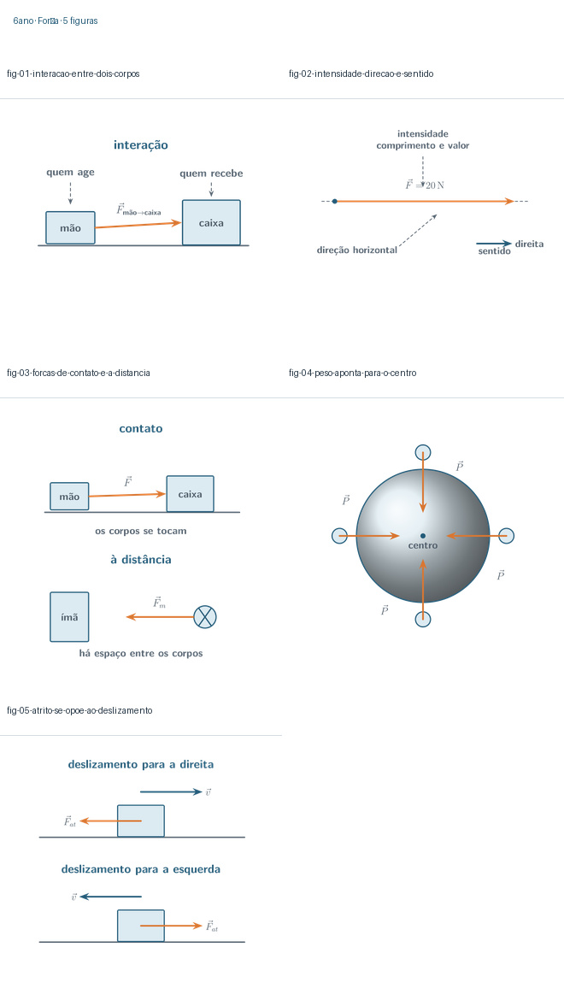

### Estrutura da Terra

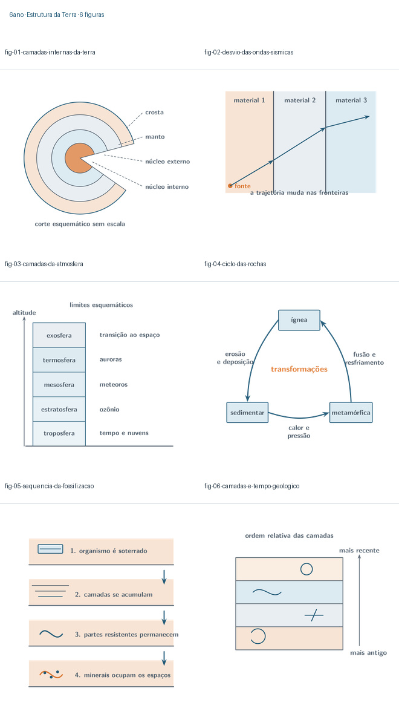

## 7º ano

### Movimento, referencial e velocidade

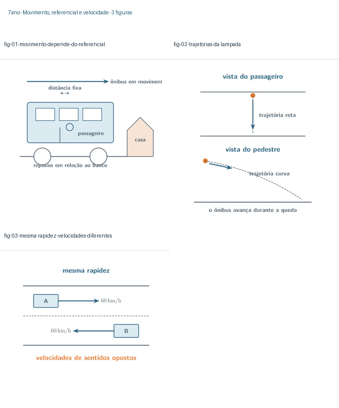

### Força e movimento

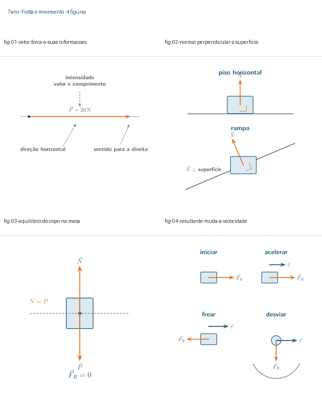

### Máquinas simples

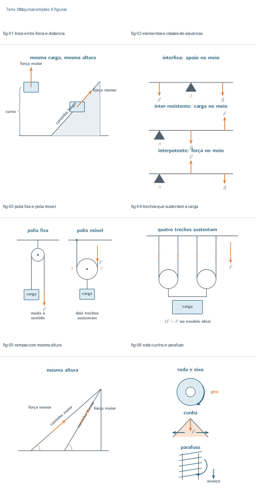

## 8º ano

### Som e luz

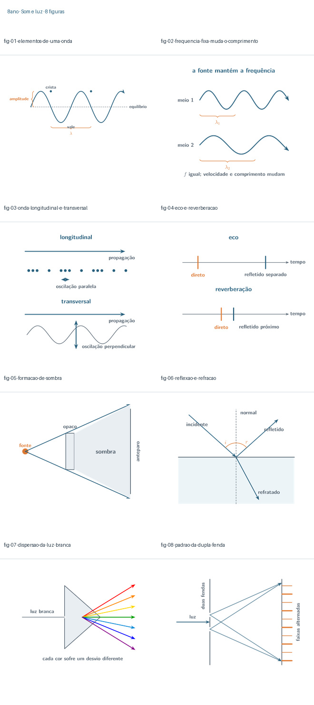

### Sistema Sol–Terra–Lua

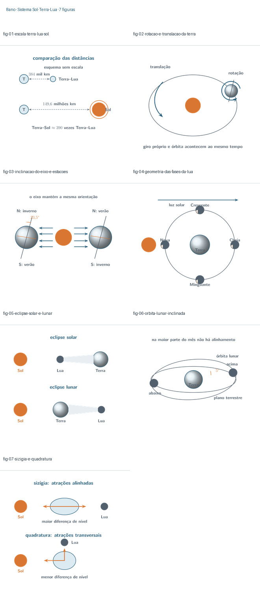

## 9º ano

### Trabalho e máquinas simples

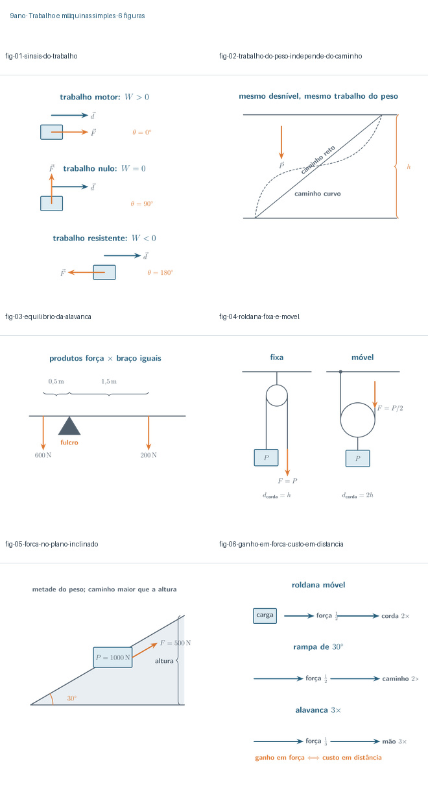

### Energia mecânica e potência

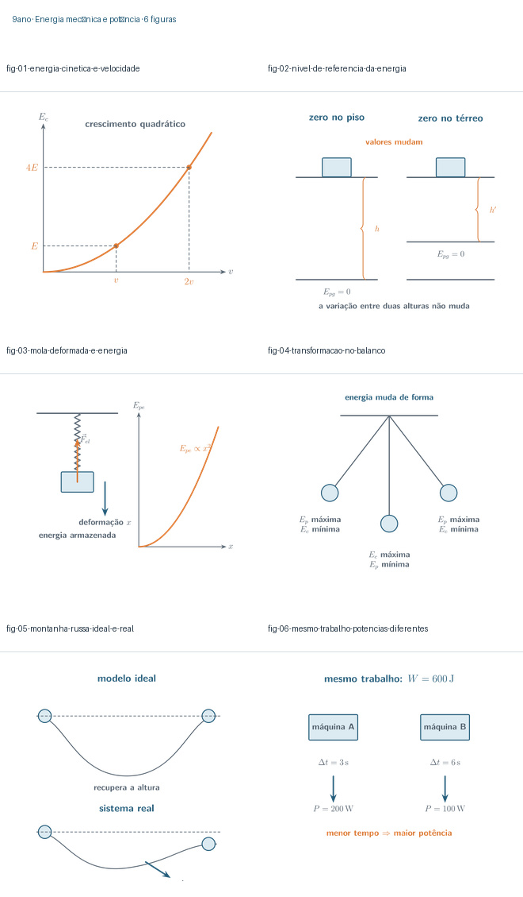

## 1ª série

### Leis de Newton

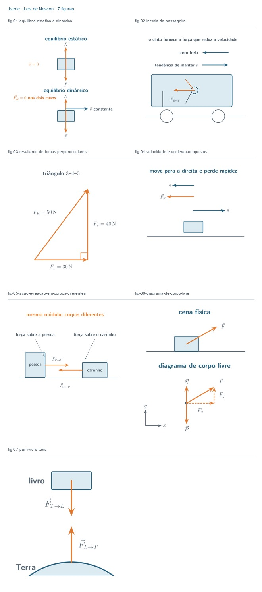

### Forças mecânicas

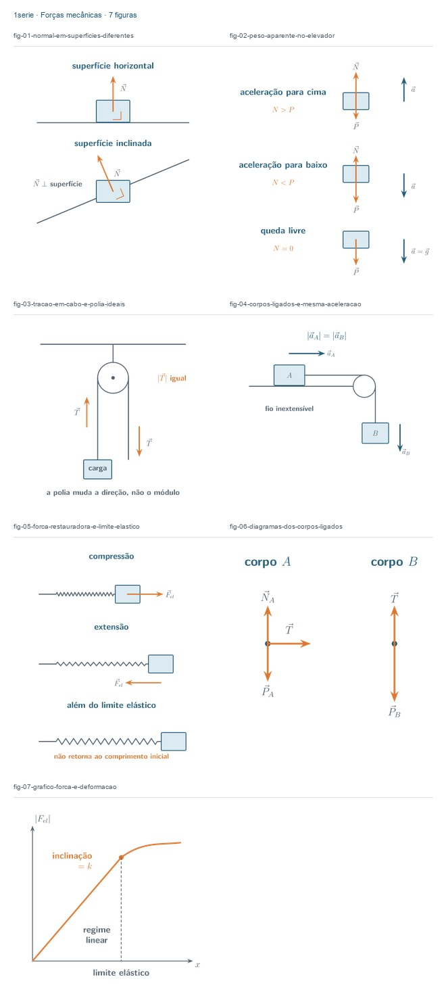

## 2ª série

### Reflexão e espelhos

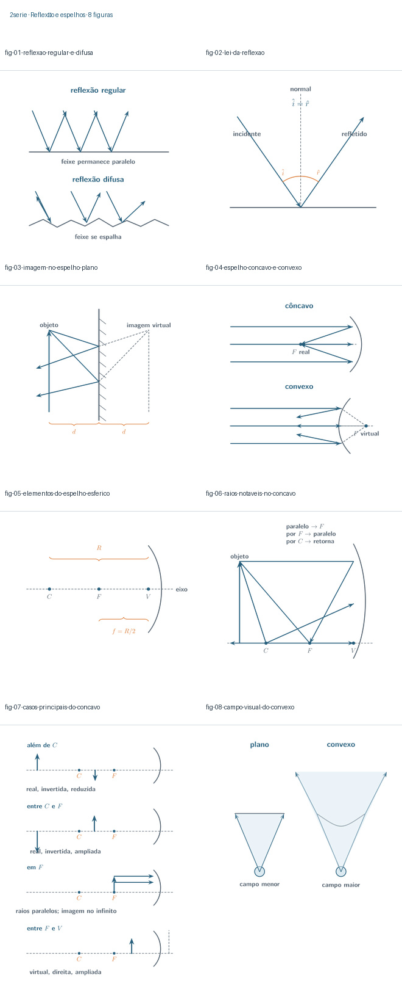

### Refração e lentes

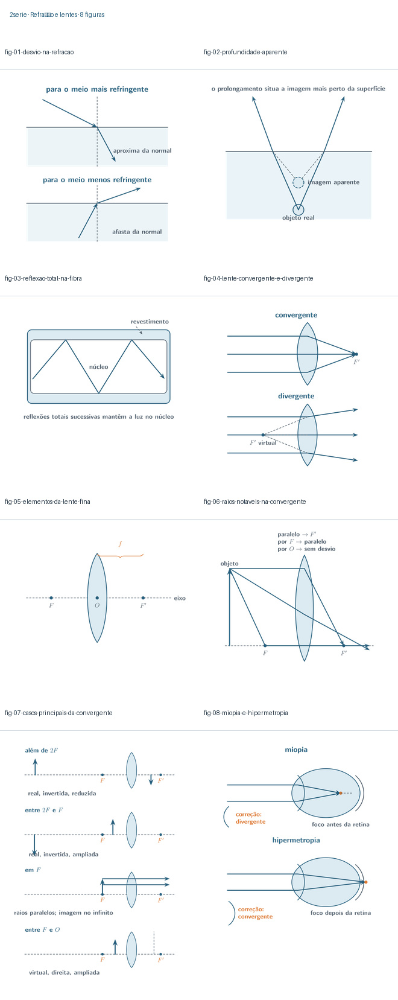

## 3ª série

### Campo magnético e suas fontes

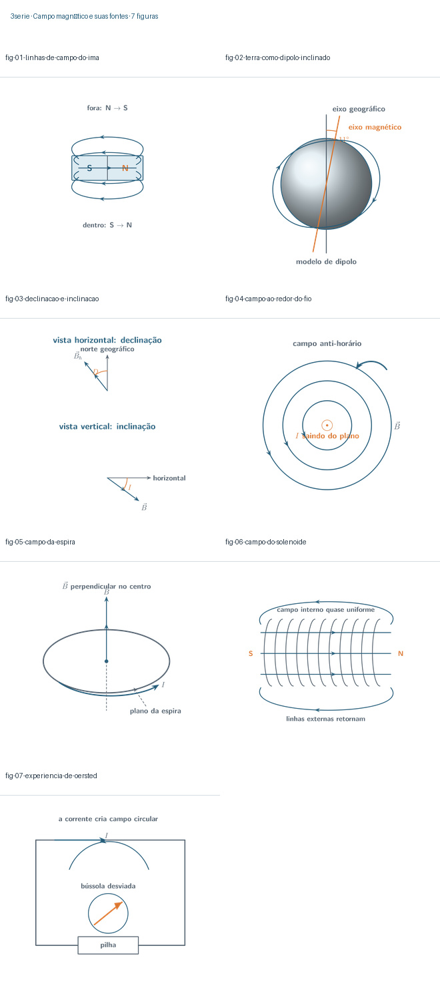

### Força magnética

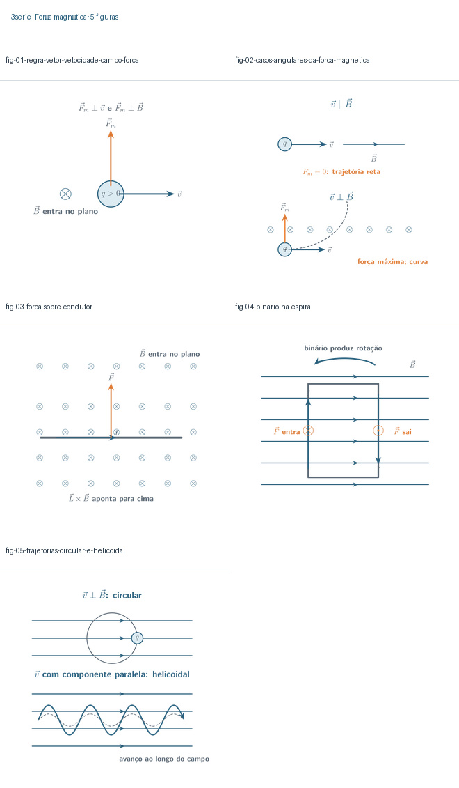

### Indução eletromagnética

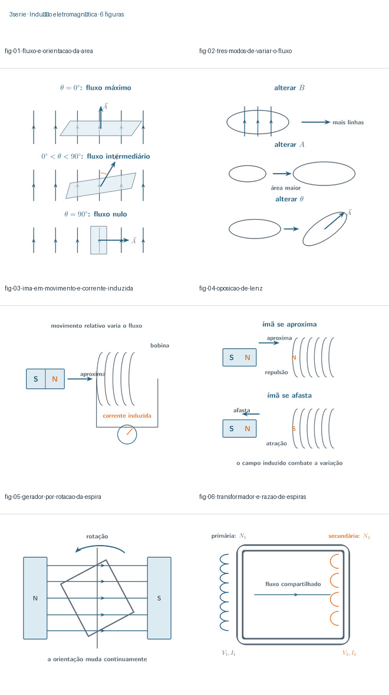

## Resultado da aprovação

1. aprovação registrada nos 16 manifestos;
2. 95 PNGs publicados no repositório público;
3. 95 imagens inseridas nos pontos pedagógicos definidos no plano;
4. 16 capítulos revisados em coluna de 720 px;
5. 95 hashes públicos confirmados;
6. 16 capítulos sincronizados nos mesmos arquivos do Google Drive;
7. leitura de retorno idêntica aos arquivos locais.

## Revisão de 04/08/2026 — 1ª série · Bloco 1

Os números acima são o registro da rodada original. A auditoria dos dois
capítulos da 1ª série contra `PADRAO-DE-IMAGENS-TIKZ.md` alterou o conjunto:

- **seis peças refeitas** por violação de respiro — `fig-02` e `fig-03` de
  Leis de Newton; `fig-01`, `fig-02`, `fig-03` e `fig-05` de Forças
  mecânicas. A mais grave era a tração desenhada sobre a própria corda,
  contra a regra de faixa paralela do §3;
- **quatro peças novas**, páginas 6 e 7 de cada fonte — o diagrama de corpo
  livre e o par livro/Terra em Leis de Newton; os diagramas dos corpos
  ligados e o gráfico $|F_{el}| \times x$ em Forças mecânicas;
- as galerias desta seção foram regeradas com as 14 peças vigentes.

Com isso a coleção de Física passa de 103 para **107 PNGs** e o commit
público vigente é `1addc5b0379a`.
